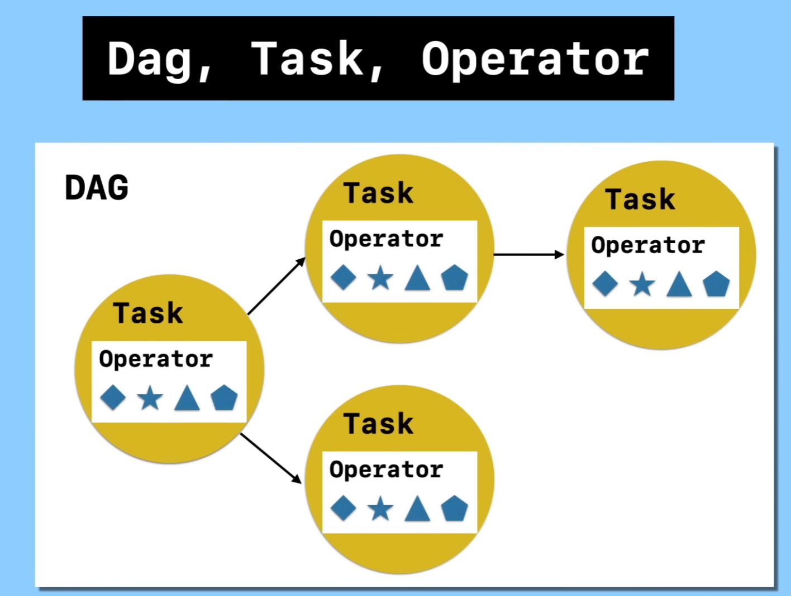
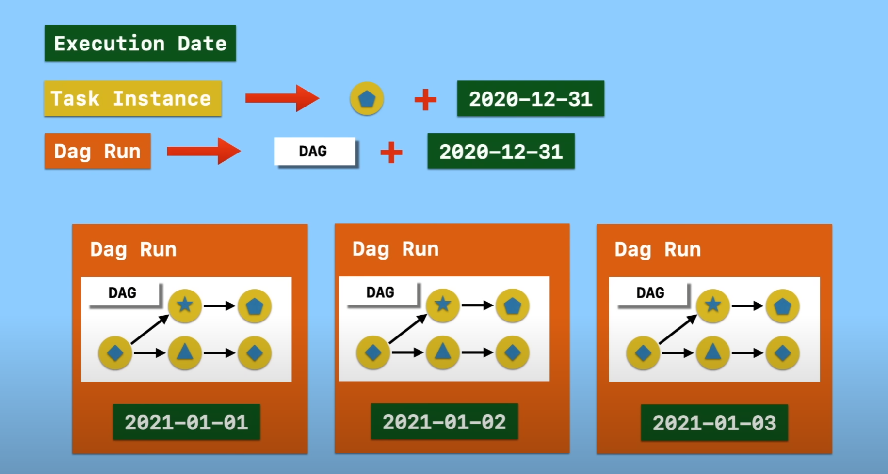

# Looking-into-airflow

## Installation

### PyPI

- [PyPI](https://airflow.apache.org/docs/apache-airflow/stable/installation/installing-from-pypi.html)
  `pip install "apache-airflow[celery]==2.8.1" --constraint "https://raw.githubusercontent.com/apache/airflow/constraints-2.8.1/constraints-3.10.txt"` match the constraints version with the python version we have
- `export AIRFLOW_HOME=${PWD}` (default is airflow directory on home)
- `airflow db init` initialize the db
  - create sqlite database
  - a log folder and,
  - some configuration files
- `airflow webserver -p 8080` start the airflow webserver
- `pip install virtualenv`: PythonVirtualenvOperator requires virtualenv

### Creating User

- just doing `airflow users create` will give the structure to follow

```
airflow users create \
          --username test123 \
          --firstname mr_test \
          --lastname okay \
          --role Admin \
          --email admin@example.org
```

- `password: admin123`
- start the airflow webserver and login with the provided credentials

### Create scheduler

- we need a scheduler in order to execute the DAG (Directed Acyclic Graph), a conceptual representation of a series of activities
  - each circle represents an activity, some of which are connected by lines representing the flow from one activity to another
- `airflow scheduler` will start the scheduler

## With Docker-compose

- [Docs](https://airflow.apache.org/docs/apache-airflow/stable/howto/docker-compose/index.html)
- `curl -LfO 'https://airflow.apache.org/docs/apache-airflow/2.8.1/docker-compose.yaml'`
- `mkdir ./dags ./logs ./plugins`
- `echo -e "AIRFLOW_UID=$(id -u)" > .env` for linux
- `docker-compose up airflow-init` initialize the database, run database migrations and create the first user account
  - `airflow:airflow` `username:password`

## Key Terms:

- Operator: determines what is going to be done
  - BashOperator
  - PythonOperator
  - CustomizedOperator
- Task: implements an operator by defining specific values for the operator, node in graph
- DAG: a collection of all the tasks we want to run, organized in a way that reflects their relationships and dependencies
  

---

- Execution date: The execution date in Airflow refers to the specific point in time for which a task instance is being executed within a DAG.
- In Airflow, the execution date is often represented in the format of YYYY-MM-DD.
- Task instance: A task instance in Airflow represents a **single occurrence of a task** within a DAG for a **specific execution date**
- DAG Run: A DAG run in Airflow refers to a single execution or run of the entire Directed Acyclic Graph (DAG) for a particular execution date
  

## Life Cycle

## Install Python Package
### Extending Airflow

- `docker build . --tag extending_airflow:latest`
- then change the image name
- `docker compose up -d --no-deps --build airflow-webserver airflow-scheduler`